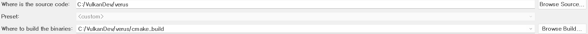
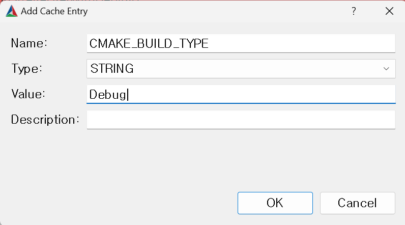
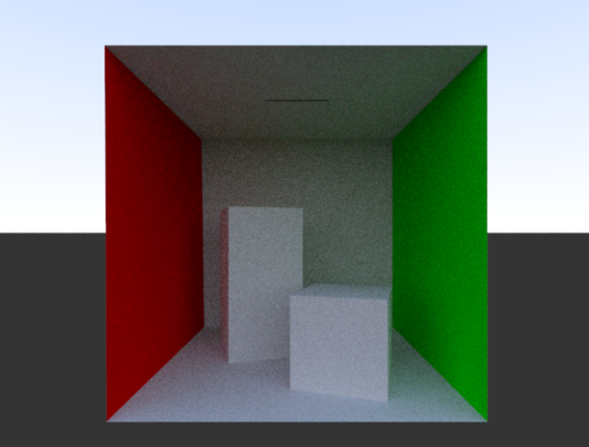

# verus

verus is a path tracer implementation empowered by nvvk framework on vulkan backend.

## Prerequisites

- Vulkan SDK (at least 1.3.261.0)
- cmake GUI
- nvpro_core library
- GPU which supports ray tracing extensions
- Windows OS

## How to run

This project heavily relies on nvpro_core library.
You should clone the repository of nvpro_core first.

```bash
git clone https://github.com/nvpro-samples/nvpro_core.git
```

Then, clone verus repository.

```bash
git clone https://github.com/codernineteen/verus.git
```

Now, your directory should follow below directory structure.

```
Current directory
└── nvpro_core
└── verus
```

After checking the directory structure, Open up cmake GUI.
You may see the 'where is the source code' and 'where to build binaries' section in your cmake-gui program like below.


1. Enter your `<PATH_TO_CURRENT_DIRECTORY>/verus` into 'where is the source code' section.
2. Enter temporary output directory for binaries (ex. cmake_build)

Now you need to add entry for Debug build.


Finally, Tap the 'configure' and 'generate' buttons in order.

If you don't see any error ouput log in the console, Congrats! you can now enjoy this project.

## Examples

1. Cornell Box (diffuse reflection only)
   

## Dependencies

- [nvpro_core](https://github.com/nvpro-samples/nvpro_core)

## References

- [vk_mini_path_tracer repo](https://github.com/nvpro-samples/vk_mini_path_tracer)
- [vk_mini_path_tracer tutorial](https://nvpro-samples.github.io/vk_mini_path_tracer/index.html)
